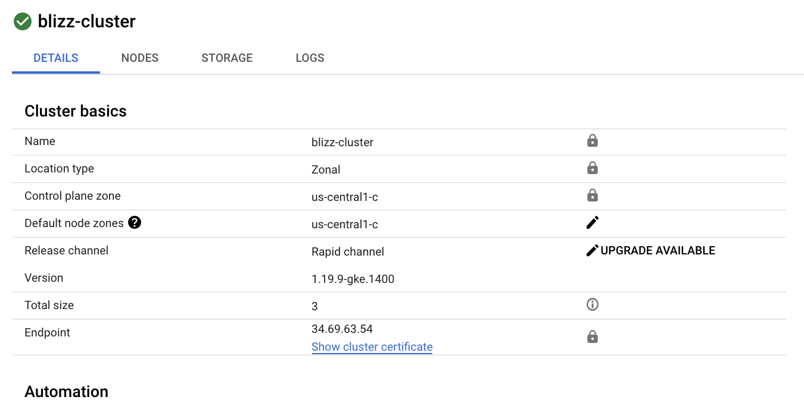
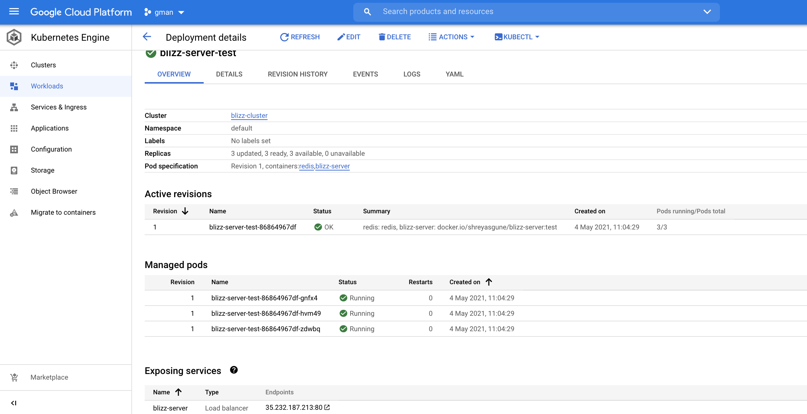
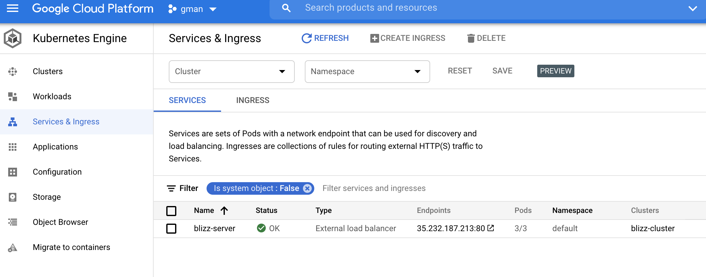

# k8-blue-green
This repo contains a sample python server and the deployment manifests.


## Local Testing

### Run the app and test
- app exec
```
cd app
pip install --upgrade pip
pip install -r requirements.txt
python th3-server.py
```

- curl tests
```
curl -s http://localhost:8080/version
    {"version": "test", "errors": []}

curl -s http://localhost:8080/api/v1/translate\?phrase\=Lol
    {"phrase": "Lol", "translation": "Kek", "errors": []}

```


### Docker Build and Push

Image Repo: [shreyasgune/blizz-server](https://hub.docker.com/repository/docker/shreyasgune/blizz-server)

```
docker build --build-arg BLIZZ_VERSION=test  -t shreyasgune/blizz-server:test .
```
> Note that the build-argument passed is the version of the application, and it gets read into the server as an environment variable.

```
docker login <credentials>
docker push shreyasgune/blizz-server:test
```
### [Minikube](https://minikube.sigs.k8s.io/docs/start/)
[Install Minikube](https://kubernetes.io/docs/tasks/tools/install-minikube/)
```
minikube start --memory=16384 --cpus=4
😄  minikube v1.5.2 on Darwin 10.14.6
✨  Automatically selected the 'hyperkit' driver
🔥  Creating hyperkit VM (CPUs=4, Memory=16384MB, Disk=20000MB) ...
🐳  Preparing Kubernetes v1.16.2 on Docker '18.09.9' ...
🚜  Pulling images ...
🚀  Launching Kubernetes ...
⌛  Waiting for: apiserver
🏄  Done! kubectl is now configured to use "minikube"
```
> yours should look similar, but not exact.

### Deploy Locally and Test it
> Go through the manifests in `local-k8` directory before applying
```
kubectl apply -f local-k8
deployment.apps/blizz-server-test created
service/blizz-server created
```

Testing
```
minikube service blizz-server --url
curl -s $(minikube service blizz-server --url)/version
    {"version": "test", "errors": []}
```

Testing Redis if using `assets/redis` manifests
```
Shell 1:
kubectl port-forward svc/redis-master 6379:6379
Forwarding from 127.0.0.1:6379 -> 6379
Forwarding from [::1]:6379 -> 6379
Handling connection for 6379

Shell 2:
redis-cli -h localhost -p 6379
localhost:6379> PING
PONG
```

## Testing BLUE-GREEN
- Build, test & push Blue Image
```
docker build --build-arg BLIZZ_VERSION=blue  -t shreyasgune/blizz-server:blue .
docker run -d -p 8080:8080 --name sgune-blizz-blue  -it shreyasgune/blizz-server:blue
curl http://localhost:8080/version
    {"version": "blue", "errors": []}
docker push docker.io/shreyasgune/blizz-server:blue
docker rm -f sgune-blizz-blue
```

- Build, test & push Green Image
```
docker build --build-arg BLIZZ_VERSION=green  -t shreyasgune/blizz-server:green .
docker run -d -p 8080:8080 --name sgune-blizz-green  -it shreyasgune/blizz-server:green
curl http://localhost:8080/version
    {"version": "green", "errors": []}
docker push docker.io/shreyasgune/blizz-server:green
docker rm -f sgune-blizz-green
```
 
- Deploy Blue to Minikube
```
sed 's/{{BLIZZ_VERSION}}/blue/g' k8s/*.yaml > blue.yaml && kubectl apply -f blue.yaml
deployment.apps/blizz-server-blue created
service/blizz-server created
```

- Start a ping test in a separate shell
```
./ping-test.sh
```

- Deploy Green to Minikube
```
sed 's/{{BLIZZ_VERSION}}/blue/g' k8s/*.yaml > blue.yaml && kubectl apply -f green.yaml
deployment.apps/blizz-server-green created
service/blizz-server changed
```

>Observe the ouput on the `ping-test.sh` shell

- Cleanup
```
rm -f blue.yaml
rm -f green.yaml
```

## Github Actions
You can also run the following jobs if you don't wish to do local-testing
- `app-build-push` workflow: Builds the image with a certain version number, tags it and pushes it to image repository
- `test-image` workflow: Tests a particular version of an existing image
- `minikube-test` workflow
    - Creates a sandboxed Minikube cluster of 1 on the github-runner
    - Deploys a particular version in Minikube
    - Tests it
- `gke-deploy.yaml` workflow: takes a version and deploys it to the `blizz-cluster` in GKE
- `switch-traffic.yaml` workflow: switches traffic to a certain version of deployment
- `security-scan.yaml` workflow: scans the image tag via version, tells you about the vulnerabilities

# Deploy and Test to GKE
Use the Github Actions jobs to deploy and test a certain version of your app.

[Example Job Run](https://github.com/shreyasgune/k8-blue-green/runs/2501600504?check_suite_focus=true)

- Cluster

- Deployment

- Services



## Future Work
- Getting Terraform to work, [files found here](assets/gke-tf.yaml)
- Speaking with [Redis Deployment](assets/redis-cluster-manifests)
- Figure out why in-pod redis doesn't look so happy

## The problem statement
```
i.            Start v1 of the application

ii.            Write a simple test client to call {service_base_url}/version repeatedly

iii.            Update the version of the sample application

iv.            Utilize your deployment strategy to execute a blue/green deploy of test application v2

v.            Capture the output of your test client to show that no requests failed and the version being returned from the sample application changed
```
